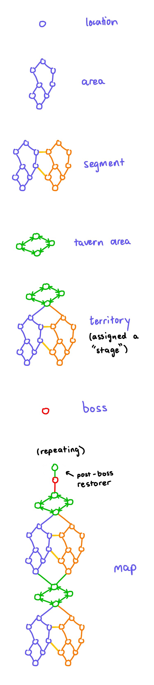
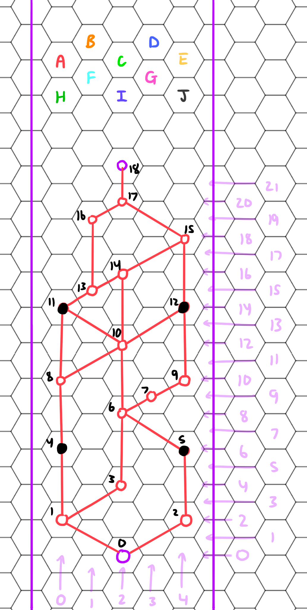
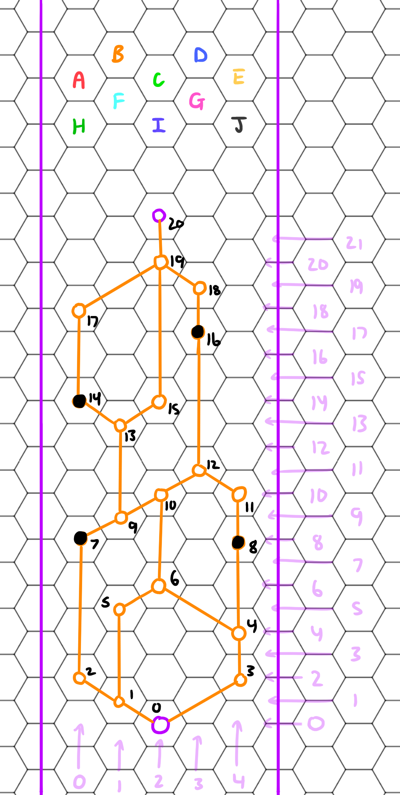
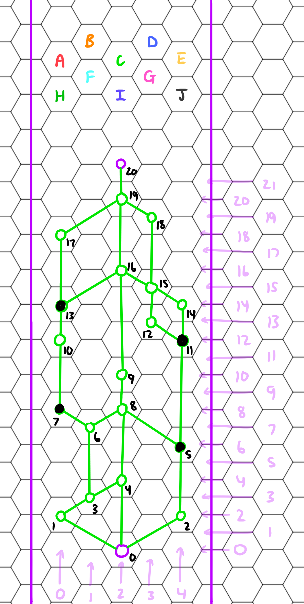
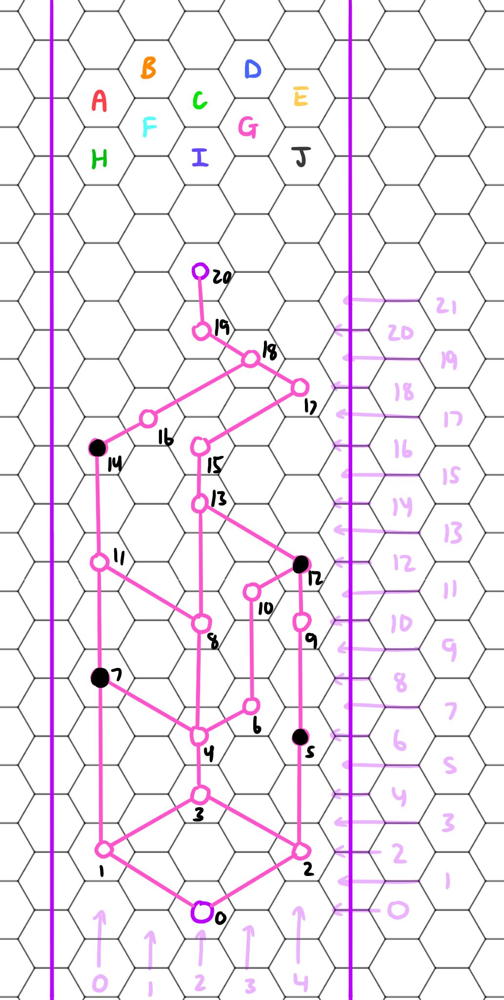
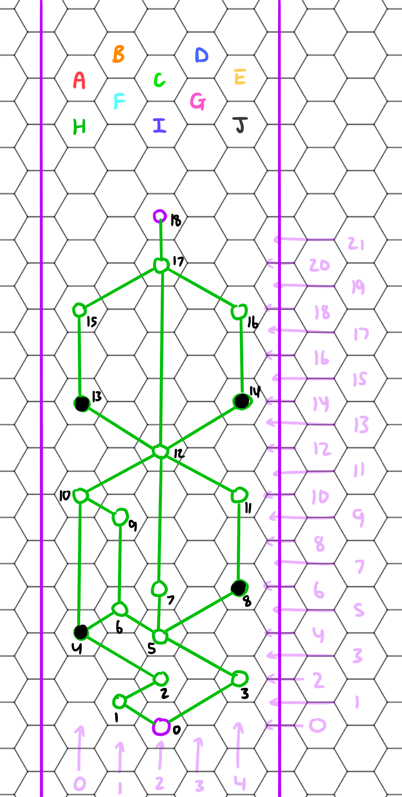

# Map Documentation

## Structure

#### Summary

The player can be at one Location (node) at once.

An Area is a graph of locations in a predefined structure.

A Segment is a collection of two adjacent areas. There is a "left" area, and "right" area which represents their arrangement.

Areas within segments are connected via Bridges, which are special Location nodes that allow a seamless transition between Areas.

A Tavern Area is a collection of Location Nodes that are non-hostile such as shops, blacksmiths, etc. It spans the width of an entire Segment.

A Territory is a Segment followed by a Tavern Area.

Bosses are found after every two Territories, and are followed by a mini Tavern Area to help the player recoup after the boss fight to continue on to the next Territory's area.

The Map is a sequence of Territories (and bosses).

 

#### Presentation

Each location presents their type in their icon. This gives purpose and meaning to the player's choices in where they want to travel.

## Locations

#### Types

| Location Type              | Description                                                  |
| -------------------------- | ------------------------------------------------------------ |
| Hostile                    | A regular hostile encounter where the player must fight      |
| Challenge Hostile          | Like a mini boss; a Hostile enemy, but more challenging, with greater reward for the player |
| Shop                       | The player may purchase items and sell items - there can be many types, such as potion shops, weapon shops, miscellaneous shops |
| Enhancer                   | An upgrade shop, where the player can purchase upgrades for their weapons and armour, as well as repairs |
| Restorer                   | The player may purchase the restoration of their health and/or armour |
| Quest (To implement later) | Provides a quest for the player to complete - by doing a task such as accumulating a certain amount of gold, or going somewhere on the map, or both such as defeating an enemy at a certain location |
| Friendly                   | These are just random friendly people, which may do things such as fully heal the player, give gold, offer a specific weapon for purchase, offer a trade such as double health for half their armour, etc. |

## Area Arrangements

#### Arrangement A

 

#### Arrangement B

 

#### Arrangement C

 

#### Arrangement D

 

#### Arrangement E

 

#### Arrangement F

 

#### Arrangement G

 

#### Arrangement H

 

#### Arrangement I

 

#### Arrangement J

 

